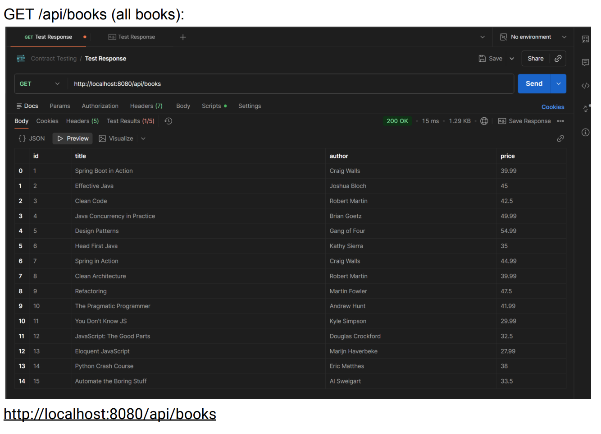
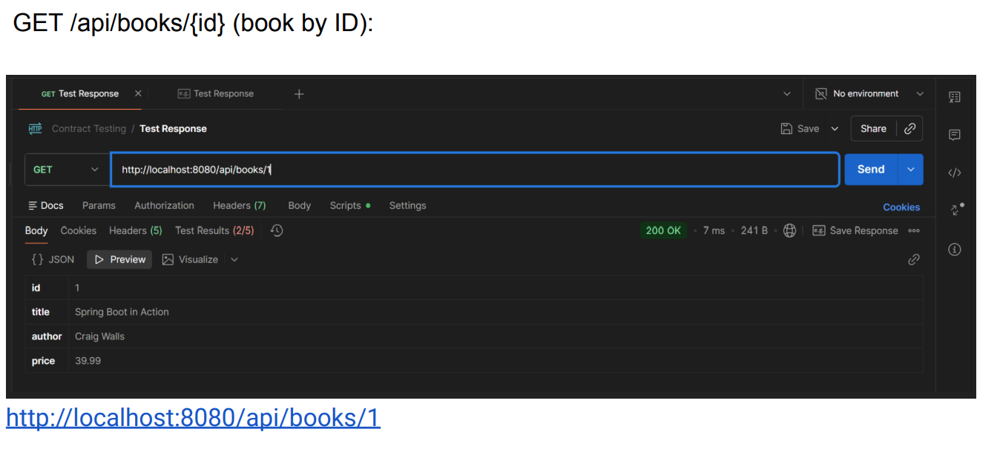
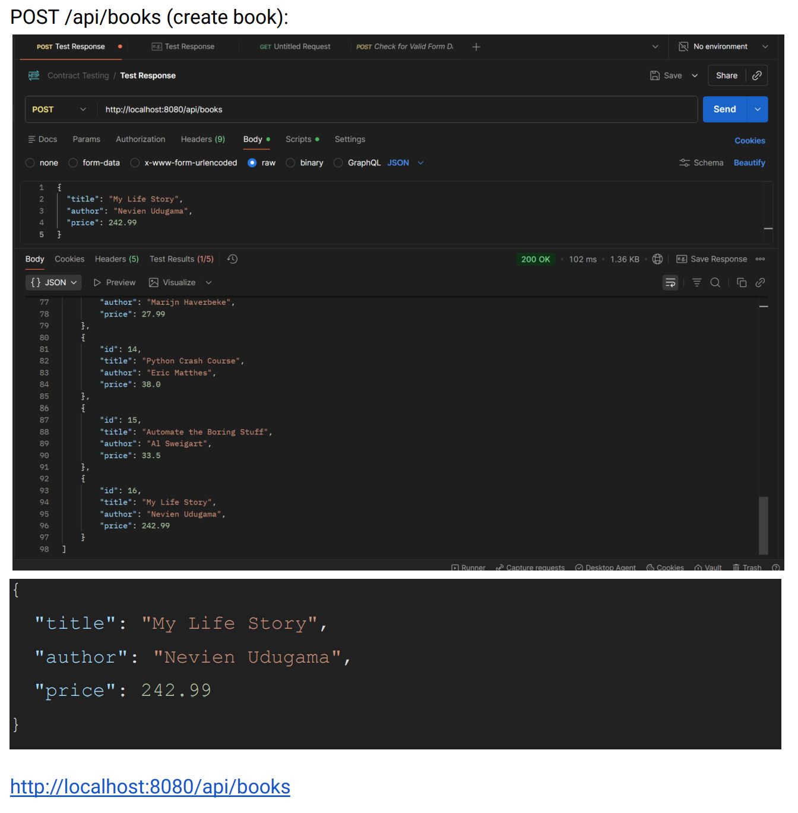
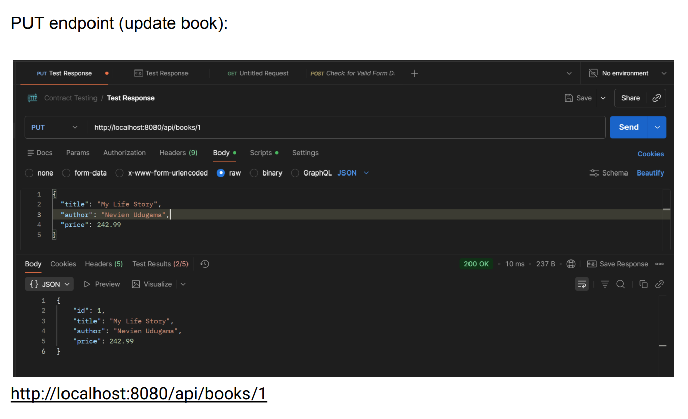
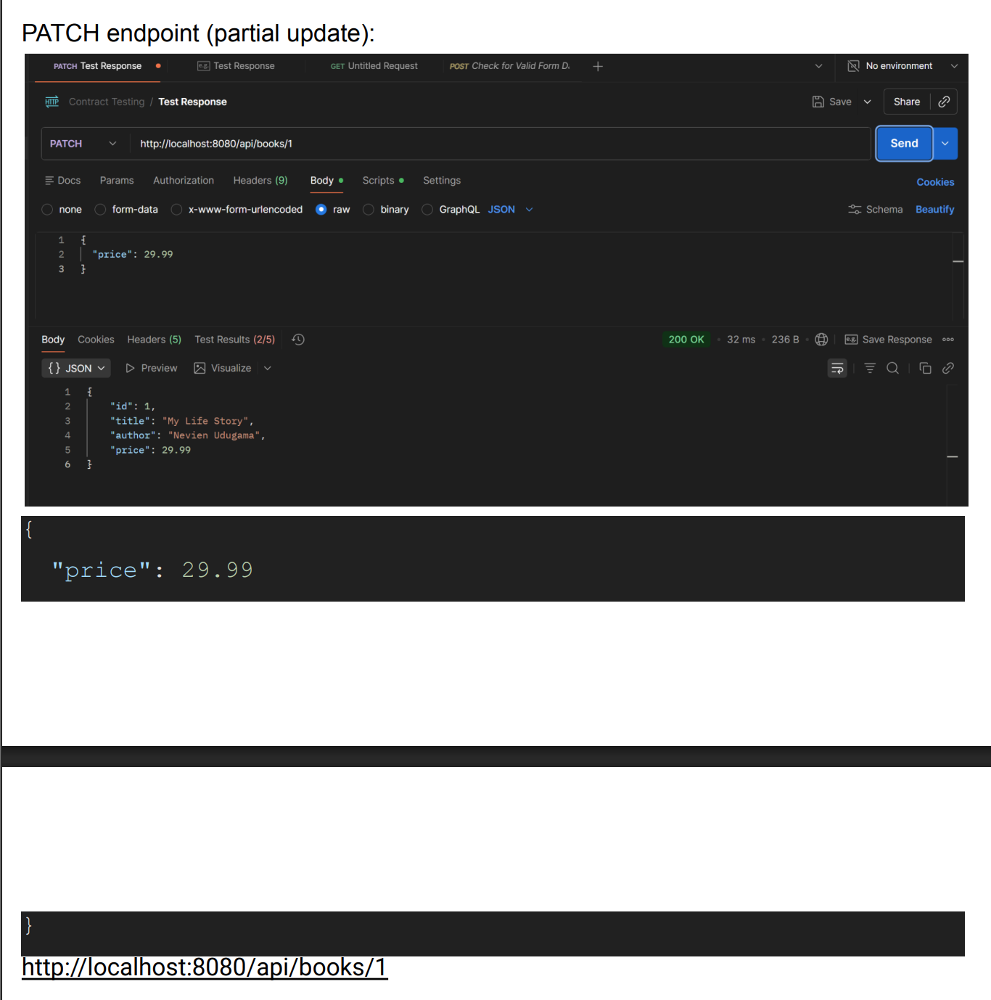
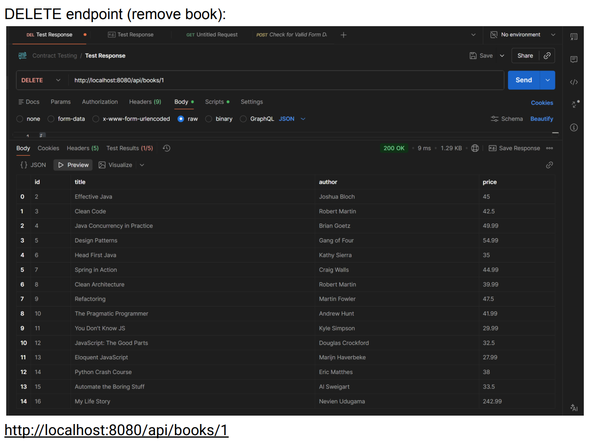
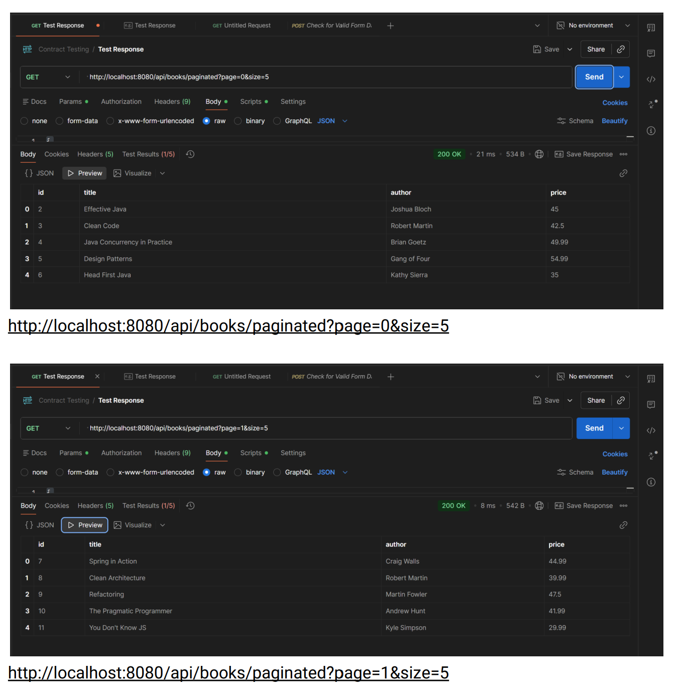
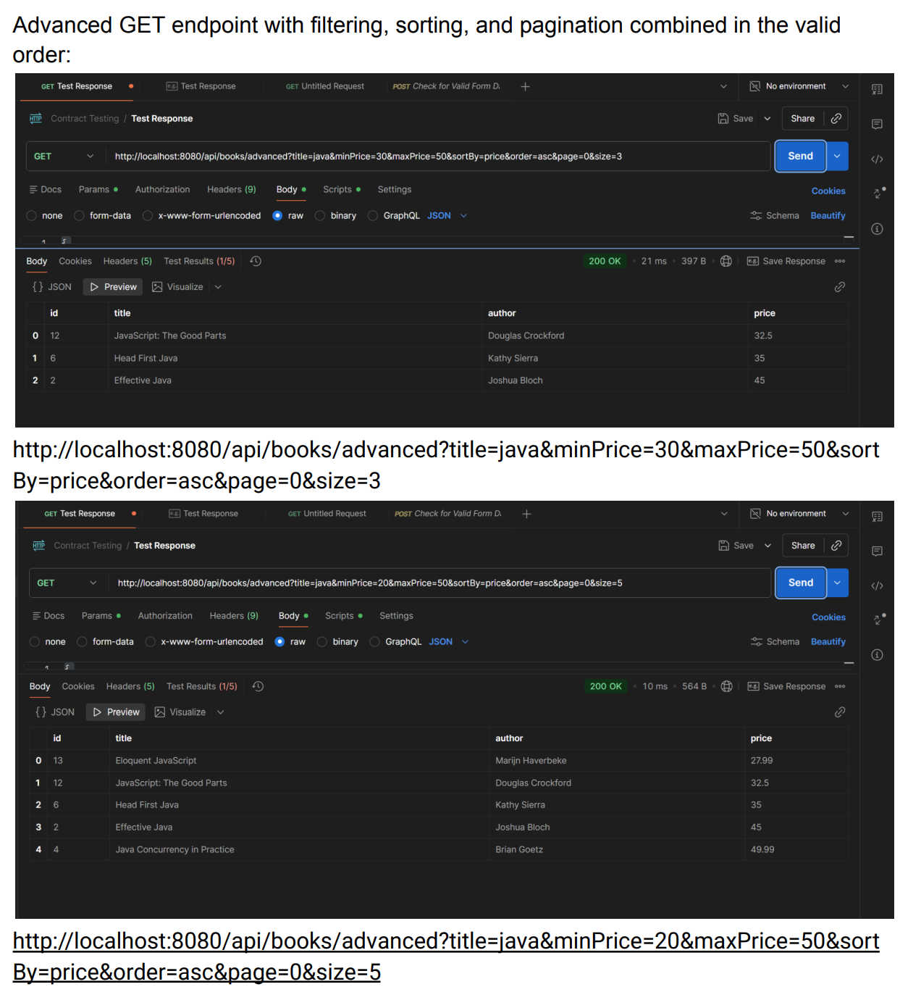

*(Note: Images were taken from a google doc for convenience)*
# **Basic Endpoints & Features**
**GET /api/books (all books):**

**GET /api/books/{id} (book by ID):**

**POST /api/books (create book):**

# **Advanced Endpoints & Features**
**PUT endpoint (update book):**

**PATCH endpoint (partial update):**

**DELETE endpoint (remove book):**

**GET endpoint with pagination:**

**Advanced GET endpoint with filtering, sorting, and pagination combined in the valid order:**

